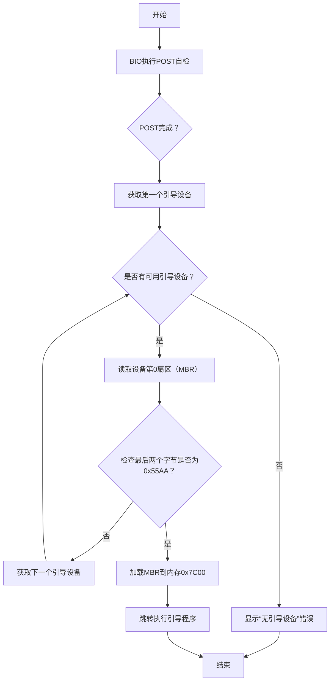

# 1.计算机启动流程

##  1.1基本流程：

> **16位实模式->跳转到BIOS->BIOS自检->运行引导代码->进入操作系统**


- 上电启动后，`CPU`处于16位运行的实模式，分页机制禁止，此时只有1MB内存可用，没有特权级
- `CPU`跳转到`BIOS`的入口（地址为`0xFFFF0`）开始执行
- `BIOS`进行硬件自检（`POST`），主板、硬盘、显卡、内存等自检，并保存一些配置数据到特定内存地址处（如硬盘的数量）

- 引导代码对操作系统的运行初始环境进行配置，并加载操作系统到内存中

- 跳转到操作系统运行

# 2.从BIOS中接管计算机的运行控制权

BIOS在完成自检后，会检查第0扇区的最后两个字节是否是`0x55`, `0xaa`，以此来判断是否包含有效的引导代码。如果是，则自动从引导磁盘的第0扇区加载引导程序到`0x7c00`处执行。具体如下图所示。


- `BIOS`会将磁盘第0扇区的512字节数据（即MBR）**复制到物理内存的`0x7C00`地址**，使其成为可执行的代码。

- 为什么会是**`0x7c00`**？

  ——历史遗留问题




**`BIOS`：**它是一组固化到计算机内主板上一个ROM芯片上的程序，它保存着计算机最重要的基本输入输出的程序、系统设置信息、开机后自检程序和系统自启动程序。 其主要功能是为计算机提供最底层的、最直接的硬件设置和控制

[4、cpu的实模式及汇编 - 知乎 (zhihu.com)](https://zhuanlan.zhihu.com/p/685171363)

# 3.创建可引导的启动程序

## 3.1文件目录说明

```asciiarmor
code/
├── .vscode/               # VS Code 配置文件
│   ├── c_cpp_properties.json  # C++ 编译配置
│   ├── launch.json        # 调试配置
│   ├── settings.json      # 代码编辑器设置
│   └── tasks.json         # 自定义任务配置
├── build/                 # 编译生成的中间文件和可执行文件
│   └── ...                # （如 .o、.exe、.dll 等）
├── scripts/               # 脚本文件
│   ├── img-write-win.bat  # 写入镜像脚本（Windows）
│   └── qemu-debug-win.bat # QEMU 调试脚本（Windows）
├── source/                # 核心源代码
│   ├── applib/            # 系统调用库
│   ├── boot/              # 引导程序
│   ├── comm/              # 通信模块
│   ├── init/              # 系统初始化
│   ├── kernel/            # 操作系统内核
│   ├── loader/            # 系统加载程序
│   ├── loop/              # 应用程序示例
│   └── shell/             # 命令行工具
├── CMakeLists.txt         # 编译配置文件
└── README.md              # 项目说明文档
```


整体的工作流程如下图所示：

- 在Visual Studio Code中编写C源文件、汇编文件、链接脚本

- CMake根据配置脚本，调用GCC对源文件进行编译和汇编，调用LD进行链接生成可执行的ELF文件

- CMake还会调用OBJCOPY将ELF文件进行缩小，或者转换成BIN文件。

- 调试前，Visual Studio Code调用一些小工具将ELF、BIN文件写入磁盘映像

- 调试时，QEMU加载磁盘映像文件，然后等待GDB连接。

- GDB连接上QEMU，开始正式的调试过程。

# 4.初始化引导程序

## 4.1.引导程序作用


> [!IMPORTANT]
>
> **实模式：**CPU启动后，自动进入所谓的实模式。可以理解其为最早期的8086芯片的工作模式。这种模式==无任何保护机制，只能运行16位代码、不支持虚拟内存、不支持访问1MB以上的内存==。后续为通过代码切换到现代的高级保护模式。


## 4.2.加载方式

​	`BIOS`只加载磁盘的第0个扇区(512字节)到内存中，此部分程序无法做很多事情。


故我们采用以下一种方式来实现：


​	本项目采用方式二，即`boot`加载`loader`，`loader`负责完成更复杂的初始工作。

## 4.3.相关寄存器

### 4.3.1通用寄存器


16位实模式下只能使用16位的`AX,BX,CX,DX`

### 4.3.2段寄存器


**实际地址:** `段基址<<4 + 偏移量`

## 4.4 8080内存映射


# 5.`BIOS`中断完成相关功能

## 5.1 `BIOS`中断

​	**在使用时并不需要知道特定函数的入口地址**，因其内部通过向量表的方式去访问，向量表里保存了函数的入口地址。在0地址处，存储着中断向量表，在访问时通过软中断`int xx`来实现对特定功能的调用。==具体每个功能的执行时需要的参数，通过寄存器传递。==


```assembly
INT 10,AH=0xE显示字符

具体来说，BH 为目前的显示页，如果是在图形模式，则 BH 须设为 0，假如是在图形模式下，也可以设定 BL 来表示文字的颜色，文字模式下的 BL 则无功能。
至于显示页是什么，不需要了解，我们只需要将它设置成零即可

// 显示引导消息"LOADING OS..."
    mov $0xe,%ah    // BIOS teletype输出功能
    mov $'L',%al
    int $0x10
```

## 5.2存储规划

​	由于`boot`的容量限制，所以将大部分初始化和加载内核的功能放在`loader`中。为了简单起见，`loader`在磁盘的位置位于紧接`boot`之后的扇区，即第一个扇区开始。长度不限。

​	boot启动之后，将调用`BIOS`中断从第1扇区加载loader到`0x8000`地址处，之后跳转到`0x8000`地址处运行。


> 这里不一定必须放在第一扇区，`0x8000`地址处，可以有其他选择。

## 5.3 `int 13`磁盘读取

`BIOS`提供了磁盘操作的服务中断，具体方法如下：

```assembly
AH = 02H
AL = 扇区数
CH = 柱面 cx = ch : cl
CL = 扇区
DH = 磁头
DL = 驱动器, 00H ~ 7FH:软盘; 80H~0FFH:硬盘
ES:BX = 缓冲区的地址
出口参数: CF = 0 ———操作成功, AL = 传输的扇区数, 否则, AH = 状态代码,参见功能号01H的说明。CF标志

	mov $0x8000, %bx	// 读取到的内存地址(目的地址)
	mov $0x2, %ah		// ah: 0x2读磁盘命令 
	mov $0x2, %cx		// ch:磁道号，cl起始扇区号
	mov $64, %al		// al: 读取的扇区数量, 必须小于128，暂设置成32KB
	mov $0x0080, %dx	// dh: 磁头号，dl驱动器号0x80(磁盘1)
	int $0x13 
	jc read_loader // 发生错误反复读取
```

> [!TIP]
>
> 注：磁盘还支持LBA模式下的读取，但是这种读取方式相比直接用BIOS会复杂一些，代码量也多，不易用汇编实现。所以，此处使用BIOS中断读取；在后续的loader实现中，将使用LBA读取，到时可以将其与INT 13读取方式进行比较。

## 5.4 GDB查看内存命令

如果要使用GDB查看内存内容，可以使用x命令，其指令格式如下：

```shell
x/<n/f/u> <addr>

n 是一个正整数,表示内存的长度
f 表示显示的格式
	x 按十六进制格式显示变量。
	d 按十进制格式显示变量。
	u 按十六进制格式显示无符号整型。
	o 按八进制格式显示变量。
	t 按二进制格式显示变量。
	a 按十六进制格式显示变量。
	c 按字符格式显示变量。
	f 按浮点数格式显示变量。
u：显示的单元大小。默认是4个bytes。b表示单字节，h表示双字节，w表示四字节，g表示八字节。
```

[直接磁盘服务中断]([BIOS int 13H中断介绍-CSDN博客](https://blog.csdn.net/wyyy2088511/article/details/118943195))

Debugging with gdb (第161页)

# 6. 跳转到指定loader运行

​	`boot`和`loader`分属两个工程，共生成两个`bin`文件。

​	从`boot`跳转到`loader`，只知道`loader`的起始地址位`0x8000`,所以采用==函数指针转换==。`(void(*)(void))`为无参数、无返回值的函数类型。`((void (*)(void))LOADER_START_ADDR)() `即认为在`0x8000`地址处存放了这种类型的函数的代码，通过调用函数函数进入到loader中运行。

> [!NOTE]
>
> 注：无论是boot还是loader，其工程均已经配置好让start.S中的代码位于生成的bin文件开头。==所以无论是boot还是loader，其最开头的指令总是程序的入口指令==。

跳转过程：

```text
<---------------------boot阶段---------------------------->                                              
	(0x7C00)                                                                                            
boot/start.S(jmp boot_entry) ───────────▶ boot/boot.c(boot_entry)                                                🔺
 											  │                                                                   |     
 											  │ ((void(*)(void)) LOADER_START_ADDR)(); jump to 0x8000			  |
 											  │                                                                   |      
 											  ▼                                                                   |      
											loader/start.S(0x8000) 												loader阶段
											  │ 																  |
											  │ (jmp loader_entry)												  |
											  │ 																  |
											  ▼ 																  |
										loader/loader_16.c(loader_entry)										 🔻
```

